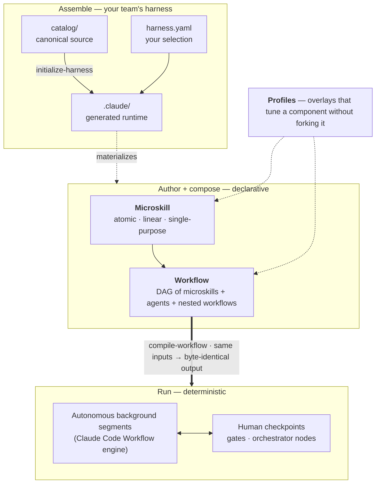

<div align="center">

# microskills

**Build atomic microskills, compose them into deterministic DAG workflows, and assemble them into an AI harness that adapts to your team.**

A composition layer for reliable, long-running multi-agent orchestration — riding Claude Code's native Workflow engine.

[](./LICENSE)
[](https://www.python.org/downloads/)
[](https://claude.com/claude-code)
[](https://github.com/sharmankitdev/microskills/actions/workflows/ci.yml)
[](./CONTRIBUTING.md)

</div>

---

## The problem

If you've ever tried to build a multi-agent execution pipeline, you've probably fought the **determinism of the orchestration**. Today you have two choices:

- **Build it as a Skill** — but Skills are *instructive* by nature, so their behavior is non-deterministic. As the pipeline grows, the orchestrator turns into a fat, rigid, verbose monolith with little room for customization.
- **Bake it into your platform's harness** — expensive, and rarely worth it: a harness that works for *you* doesn't work for *others*, because different people and teams have different styles of working.

The outcome: everyone re-solves the same orchestration problem, in their own way, over and over.

## The flip

What if, instead of building something everyone must conform to, we build something that **adapts to everyone**?

microskills is a lightweight set of **building blocks** you piece together to configure your own harness — and it **guarantees the determinism of orchestration by compiling it**, not by writing more prose to keep an LLM in line.



## How it's different

| | Fat orchestrator Skill | microskills + workflows |
|---|---|---|
| **Execution** | Instructive → non-deterministic | Compiled → deterministic (byte-identical output) |
| **Structure** | One rigid monolith | Atomic units composed in a declarative DAG |
| **Scaling** | Gets verbose as the pipeline grows | Modular — complexity stays per-unit |
| **Reuse** | Copy / fork | Plug a unit into any workflow that needs it |
| **Customization** | Edit the monolith in place | Tune via profile overlays — no fork |
| **Across teams** | One-size-fits-all harness | Each team assembles its own from shared blocks |

## The four pillars

### 1. Microskills — atomic, single-purpose, reusable
One unit of work with a declared **input contract**, bounded customization knobs (**profiles**), and an explicit **output schema**. No branching, no hidden state — `validate-microskill` regex-rejects control-flow keywords (`if` / `else` / `for each` / `retry` / `when…then` / …) and caps steps to a single linear path (≤10). The payoff: a microskill does *exactly one thing*, so it plugs into any workflow that needs that thing.

### 2. Workflows — compiled, deterministic orchestrators
A declarative `WORKFLOW.yaml` DAG that composes microskills, agents, and even nested workflows. All control flow — gates, loops, conditionals (`when`), fan-out (`for_each`) — lives in the YAML. `compile-workflow` then partitions it into **autonomous background segments** (run on Claude Code's native Workflow engine) separated by **human checkpoints** — and it's deterministic: *same inputs → byte-identical output*. Determinism comes from the compile step, not from hoping the model behaves.

### 3. Customizations (Profiles) — tune without forking
Profiles are YAML overlays deep-merged onto a component's `base`. Swap the executor agent or model, soften a gate from `hard` → `warn` (e.g. an `autonomous` profile that runs a workflow end-to-end with no human pause), retarget template vars — all without copying the component. Merge rules are predictable: `output_schema` replaces wholesale, `gates.add` appends, everything else deep-merges. Resolution order: explicit flag → `base.profile.default` → `base`.

### 4. Dynamic Harness Initialization — a harness that adapts to your team
A project declares its working set in `harness/harness.yaml`, each entry tagged `source: plugin | custom`. `initialize-harness` bootstraps the runtime from the plugin catalog (the engine + every `source: plugin` component); `harness-sync` reconciles your locally authored `source: custom` components. A `.harness-state.json` ledger keeps the two scoped and **non-destructive** — neither ever touches the other's entries, and an unmanaged path is never modified. You assemble the *exact* harness your team works with — nothing more, nothing less.

## Quickstart

```bash
# In Claude Code:
/plugin marketplace add sharmankitdev/microskills   # or a local path to this repo
/plugin install microskills@microskills
/microskills:initialize-harness                      # bootstrap .claude/ from the catalog
```

**Restart Claude Code after `initialize-harness`.** The materialized dispatchers, per-component command shims, and the agents register only on the next session start — until you restart, `/sync-harness`, `/microskill-create`, `/workflow-create`, and the agents won't resolve in-session.

Then build:

```bash
/microskill-create "validate that a YAML file matches a JSON schema"
/workflow-create   "plan a feature, implement it, then review the diff"
```

## How it works

**Author + compose.** A workflow is just a DAG. Nodes `use:` a microskill (or run an `agent:`, or hand off to an `orchestrator` checkpoint); edges are `depends_on`; gates and loops are declared inline. Here's the spine of the built-in `microskill-create` workflow:

```yaml
nodes:
  - id: plan
    use: task-plan
    customize: { profile: microskill }
    inputs: { requirement: ${workflow.inputs.requirement} }

  - id: implement
    use: task-implement
    when: ${plan.output.scope_advisory == null}
    depends_on: [plan]

  - id: evaluate
    use: task-evaluate
    depends_on: [implement, plan]

gates:
  - id: approve_plan          # human checkpoint between segments
    after: plan
    type: human_approval
    severity: hard
    options: [approve, revise, abandon]

loop:                         # retry implement→evaluate until it passes
  while: ${!evaluate.output.pass}
  max_iters: 3
  body: [implement, evaluate]
```

**Customize without forking.** The same microskill serves two domains by overlaying a profile. `task-implement` ships a `microskill` profile (the default — it inherits `base` verbatim) and a `workflow` overlay. The entire delta is **two lines** — contract doc and executor agent; the model, inputs, and output schema are all inherited:

```diff
# task-implement/profiles/ — one microskill, two domains (full delta = 2 lines)
  version: 1
  vars:
-   contract_doc: .claude/workflow-defs/microskill-create/references/implementer.md   # microskill profile (= base)
+   contract_doc: .claude/workflow-defs/workflow-create/references/implementer.md     # workflow overlay
  runtime:
-   agent: microskill-implementer
+   agent: workflow-implementer
    model: opus      # shared — inherited from base; neither profile overrides it
# inputs + output_schema are identical across domains, so they live once in base
```

**Run.** `compile-workflow` turns the YAML into background segments + checkpoints; the `workflow` dispatcher then conducts: it runs each segment autonomously on the native engine, pauses at each human checkpoint (where `AskUserQuestion` works), and threads outputs forward. The autonomous engine can't pause for a human — so *all* interaction lives at the checkpoints between segments.

## The harness model (reference + vendoring)

A project doesn't pull the whole catalog into its workspace. It declares a **harness** — the curated working set it uses — and the runtime is generated from it:

```
catalog/                       # canonical registry (committed; ships in the plugin)
  microskills/ workflow-defs/ agents/ scripts/ skills/ commands/

harness/harness.yaml           # this project's selection: microskills[] + workflows[],
                               #   each {name, profiles, source: plugin|custom}
harness/microskills|workflow-defs/<name>/   # committed bytes of source:custom components ONLY
        │
        │  initialize-harness   (source: plugin → .claude/, + the engine)
        │  harness-sync         (source: custom  → .claude/)
        ▼
.claude/                       # generated runtime (gitignored)
  scripts/ skills/ agents/ microskills/ workflow-defs/ commands/<name>.md
  templates/references/        # schemas + component templates (materialized engine asset)
  .harness-state.json          # ownership ledger; entries tagged plugin|custom (+ an engine block)
```

`initialize-harness` is the one globally-registered plugin command. On first run it seeds `harness.yaml` from the catalog's base set, lays down the engine, and materializes every `source: plugin` component. `harness-sync` then owns ONLY `source: custom` components and **never touches** plugin/engine entries (and vice versa). Both are scoped and non-destructive: a path with no ledger entry is never modified or removed.

**After a plugin update**, re-run `initialize-harness`. It refreshes any `source: plugin` / engine components whose catalog bytes drifted (hash-gated update), and reports `available_base` — base components newly released in the catalog that your `harness.yaml` predates (it only *seeds* the base set on first run, when `harness.yaml` is absent — it never silently rewrites an existing manifest). Re-run with `--adopt-base` (or pick "apply + adopt base" at the `/initialize-harness` confirm gate) to append those entries as `source: plugin` and materialize them. `harness-sync` does **not** pull new base components — it is scoped to `source: custom`; a first session touching the `microskill` / `workflow` / `sync-harness` skills surfaces a one-line drift advisory pointing here.

> **This repository is the plugin source.** `catalog/` is the committed source of truth; the runtime `.claude/` is **generated and gitignored — even here** (the repo dogfoods the consumer flow). After cloning, rebuild it:
>
> ```bash
> catalog/scripts/initialize-harness --apply --project-root . --catalog ./catalog
> catalog/scripts/harness-sync --apply             # any source:custom components you author under harness/
> ```

## Engine

Engine source lives under `catalog/scripts/` and is materialized into `.claude/scripts/` at init:

| Piece | Role |
|---|---|
| `resolve-microskill` | Resolve a microskill + profile into an executable body. |
| `compile-workflow` | Compile a `WORKFLOW.yaml` into background segments + checkpoints (deterministically). |
| `initialize-harness` | Bootstrap `.claude/` from the catalog: engine + `source: plugin` components. |
| `harness-sync` | Reconcile `source: custom` components `harness/` → `.claude/`. |
| `validate-microskill` / `validate-workflow` | Schema + semantic validation. |

The plugin registers exactly one global command — `/microskills:initialize-harness`. Everything else (`/sync-harness`, `/microskill-create`, `/workflow-create`, the per-component shims, and the `microskill` / `workflow` dispatchers) is materialized into the project's `.claude/` at init.

## Development

Requires Python 3.11+ with `pyyaml` and `jsonschema`.

```bash
pip install pyyaml jsonschema pytest
# Bootstrap the runtime (catalog/ → .claude/), then run the suite:
catalog/scripts/initialize-harness --apply --project-root . --catalog ./catalog
python3 -m pytest catalog/scripts/tests/ -v      # full suite
```

The reconcile loops are dry-run by default (`--apply` to execute + record the ledger):

```bash
catalog/scripts/initialize-harness --plan        # engine + source:plugin
catalog/scripts/harness-sync --plan              # source:custom add/update/remove
```

Compiled workflow output (`**/.compiled/`) and staging dirs are generated and gitignored; `compile-workflow <name>` regenerates them.

## Contributing

This is an MVP and contributions are welcome — see **[CONTRIBUTING.md](./CONTRIBUTING.md)** for the repository model, how to add components, and the test approach. Open an issue or a PR.

## License

[MIT](./LICENSE) © Ankit Sharma
